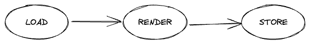

# Neon

Neon is an web server with specific features dedicated to serve your web applications. Like any other web servers, websites are served to clients but with two major differences:

- it can fetch data from external services

- it can render web pages with its Javascript VM

These capabilities allow to serve contentful web pages with minimal loading time.

## How does it work ?

### Concept

The workflow of Neon can be resumed by this schema:

**Load**

The first step is to fetch all resources required for an application for its content. This step is independent from the client requests processing and rendering i.e. everything is done in background. All these data are called the _server state_. The server state is never removed but refreshed following the configuration rules defined by the user.

**Render**

The second step is to render the application pages. In case of a Javascript applpication, this is done by executing its bundle file with the internal Javascript VM. The final render contains all required content and is ready for any clients like SEO bots and browsers.

**Store**

The third step is to store in a memory cache the final renders for a given time-to-live period. It will prevent useless processing and will allow to send directly responses to clients.

:::info

Neon is an early project. This section above tends to focus on the main ideas of this project but new features and improvements are coming.

:::
